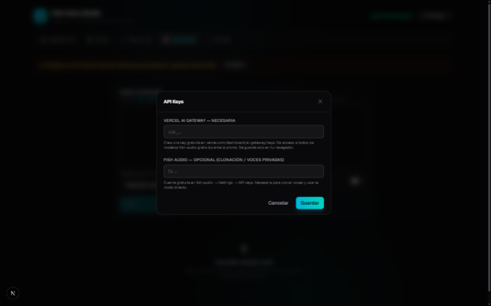
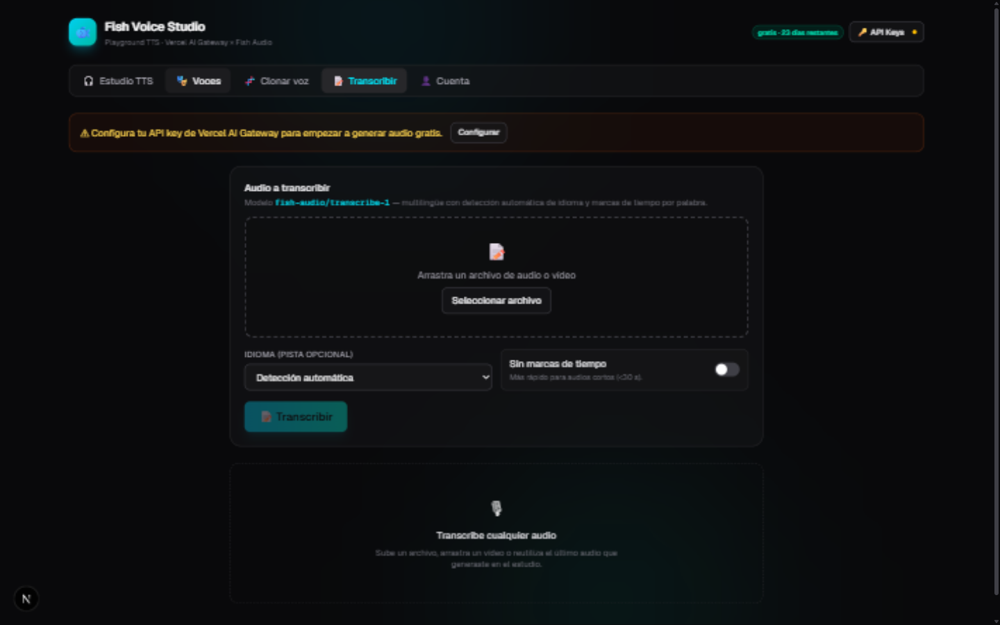

# 🐟 Fish Voice Studio

**Playground de texto a voz (estilo ElevenLabs) para los modelos Fish Audio — gratis en Vercel AI Gateway hasta el 18 de septiembre de 2026.**

[](https://nextjs.org)
[](https://ai-sdk.dev)
[](LICENSE)
[](https://vercel.com/changelog/fish-audio-models-now-available-on-ai-gateway-for-free)

> **English TL;DR** — A complete open-source text-to-speech playground (ElevenLabs-style) for Fish Audio models (`s2.1-pro`, `s2-pro`, `s1`, `transcribe-1`) served through the Vercel AI Gateway, free until **Sep 18, 2026**. Browse 1000+ community voices with instant preview, clone your own voice from recordings or mic takes, transcribe audio with word-level timestamps, and fine-tune every audio parameter the API exposes (format, bitrate, speed, volume, temperature, latency…). Long texts are auto-split and merged into a single file. Built with Next.js 16 + AI SDK 7. Full documentation below is in Spanish. `npm install && npm run dev`, add your free AI Gateway key, done.

---

## ✨ Capturas

| Estudio TTS | Librería de voces |
|:---:|:---:|
|  |  |

## 📋 Contenido

- [Modelos incluidos](#-modelos-incluidos)
- [Características](#-características)
- [Instalación y puesta en marcha](#-instalación-y-puesta-en-marcha)
- [API keys](#-api-keys)
- [Guía de uso](#-guía-de-uso)
- [Despliegue en producción](#-despliegue-en-producción)
- [Arquitectura del proyecto](#-arquitectura-del-proyecto)
- [Solución de problemas](#-solución-de-problemas)
- [Contribuir](#-contribuir)
- [Licencia](#-licencia)

## 🤖 Modelos incluidos

| Modelo | Uso | Precio normal | Ahora |
|---|---|---|---|
| `fish-audio/s2.1-pro` | TTS · mejor calidad · 80+ idiomas | $15 / M caracteres | **Gratis** |
| `fish-audio/s2-pro` | TTS · prosodia natural · multi-hablante | $15 / M caracteres | **Gratis** |
| `fish-audio/s1` | TTS · marcadores de emoción | $15 / M caracteres | **Gratis** |
| `fish-audio/transcribe-1` | Voz a texto con timestamps | $0.36 / hora | **Gratis** |

> ⚠️ **Al acabar la promo (18-sep-2026)**: el sufijo `-free` (activo por defecto en la app) hace que los modelos **dejen de servir en lugar de empezar a cobrar** automáticamente en tu cuenta de Vercel.

## 🌟 Características

### 🎧 Estudio TTS
- **Texto sin límite**: los textos largos se dividen automáticamente por oraciones (tamaño configurable), se generan por segmentos con barra de progreso y se **unen en un solo archivo** (WAV re-codificado correctamente; MP3/Opus concatenados).
- **3 modelos de voz** con selector visual y sufijo `-free` conmutable.
- **Miles de voces** de la librería pública de Fish Audio: búsqueda, filtro por idioma/etiqueta, orden por popularidad, **preview en un clic**, favoritos y voces por id manual.
- **Diálogo de 2 voces** (S2/S2.1): asigna Voz A y Voz B y marca los turnos con `<|speaker:0|>` / `<|speaker:1|>`.
- **Marcadores de prosodia/emoción** insertables en el cursor: `[whispers]`, `[excited]`… (S2) o `(laughing)`, `(angry)`… (S1).
- **Pronunciación automática de citas bíblicas**: reconoce los 73 libros, nombres completos y abreviaturas (`Gn. 1:1`, `1 Jn 4:8`, `Heb. 11:3,6-8`) y ofrece estilo compacto (“Génesis, uno, uno”) o narrado (“Génesis, capítulo uno, versículo uno”). Solo transforma la copia enviada al TTS; el texto original se conserva intacto.
- **Diccionario de pronunciación editable**: corrige palabras que una voz pronuncia mal (`mengüe → méngüe` viene incluida). Permite añadir, editar, activar, buscar y eliminar reglas; importar/exportar JSON y restablecer. Se guarda por navegador y solo modifica la copia enviada al sintetizador.
- **Controles de audio completos** (todo lo que expone la API): formato (MP3/WAV/Opus/PCM), bitrate, frecuencia de muestreo, latencia, **velocidad**, **volumen en dB**, normalización de sonoridad, temperatura y top-P (creatividad), chunk length, condicionado entre segmentos y *quality guard*.
- **Dos motores**: *Vercel Gateway* (gratis durante la promo) o *Fish directo* con tu propia key (necesario para voces privadas; usa `prosody_speed`/`prosody_volume` nativos).
- **Historial de generaciones** con reproductor, velocidad de reproducción, descarga por segmento o unido, avisos del modelo y coste estimado ($0 durante la promo).

### 🎭 Voces
- Navegación completa de la librería pública (hasta 1000 resultados por búsqueda según la API).
- **Favoritos persistentes** (localStorage) y sección *Mis voces*: clonadas de tu cuenta de Fish Audio + ids pegados a mano.
- Botón **Usar voz** que salta directo al estudio con la voz ya asignada.

### 🧬 Clonar voz
- Sube clips de referencia (WAV/MP3/M4A/Opus) o **graba directamente del micrófono** (la grabación se convierte a WAV en el navegador).
- Transcripción opcional por clip para mayor fidelidad, título, descripción y visibilidad (privada / no listada / pública).
- Entrenamiento *fast* con **polling automático** del estado hasta que la voz queda lista; después: *Usar en el estudio* o copiar el id.

### 📝 Transcribir
- `transcribe-1`: arrastra audio/vídeo o reutiliza tu último audio generado.
- Detección automática de idioma, **marcas de tiempo por palabra**, exportación **.txt / .srt / .json**.

### 👤 Cuenta
- Cuenta atrás del fin de la promo, balance y gasto de créditos del Gateway, validación de ambas keys y tabla de precios posteriores.

## 🚀 Instalación y puesta en marcha

Requisitos:

- **Node.js 18 o superior** (probado con Node 22) — [descargar](https://nodejs.org)
- Una **API key de Vercel AI Gateway** (gratis, ver abajo)
- Opcional: una cuenta en [fish.audio](https://fish.audio) para clonar voces

Pasos:

```bash
# 1. Clona el repositorio
git clone https://github.com/Master1128/fish-voice-studio.git
cd fish-voice-studio

# 2. Instala las dependencias
npm install

# 3. Arranca la app en modo desarrollo
npm run dev
```

Abre <http://localhost:3000> en tu navegador. Listo — no hay base de datos ni más configuración.

Para compilar y correr en modo producción localmente:

```bash
npm run build
npm start
```

## 🔑 API keys

Pulsa el botón **🔑 API Keys** de la cabecera e introduce:

1. **Vercel AI Gateway** *(necesaria para TTS y transcripción)* — créala gratis en
   [vercel.com/dashboard/ai-gateway/keys](https://vercel.com/dashboard/ai-gateway/keys).
   Cualquier cuenta de Vercel (incluida la gratuita) sirve.
2. **Fish Audio** *(opcional: clonación de voces, voces privadas y modo directo)* — cuenta
   gratuita en [fish.audio](https://fish.audio) → *Settings → API keys*.

Las keys se guardan **solo en el `localStorage` de tu navegador** y viajan exclusivamente a las rutas locales de esta app (`app/api/*`); nunca se envían a terceros ni quedan registradas en ningún servidor.

Alternativa por variables de entorno (útil en despliegues): copia `.env.example` a `.env.local`:

```bash
cp .env.example .env.local
```

```
AI_GATEWAY_API_KEY=vck_...   # Vercel AI Gateway
FISH_AUDIO_API_KEY=fa-...    # Fish Audio (opcional)
```

## 📖 Guía de uso

1. **Configura tu key del Gateway** (botón *API Keys*).
2. En **Estudio TTS**, escribe o pega cualquier texto — no hay límite de longitud.
3. Elige **modelo** (S2.1 Pro recomendado) y **voz** (botón *Elegir* → busca, escucha previews y selecciona).
4. Ajusta los **controles de audio** que quieras (velocidad, volumen, formato…). Los valores por defecto funcionan bien.
5. Pulsa **🎧 Generar voz** (o `Ctrl+Enter`). Los textos largos se procesan por segmentos con progreso visible y se unen al final.
6. Reproduce, descarga y repite. Tus ajustes quedan guardados entre sesiones.

**Trucos:**

- Diálogo: activa *Diálogo (2 voces)*, elige Voz A y Voz B, y escribe cada turno precedido de `<|speaker:0|>` o `<|speaker:1|>` (hay botones para insertarlos).
- Prosodia: inserta `[softly]`, `[pause]`… dentro del texto para dirigir la entrega (S2), o `(laughing)`, `(whispering)`… (S1).
- Voces propias de fish.audio: pega su *Model Id* en la pestaña Voces → *Mis voces* → *Añadir*.
- Para audios de máxima calidad inalterable, genera en **WAV**.

## 🌍 Despliegue en producción

### Vercel (recomendado)

1. Haz fork del repositorio y en [vercel.com/new](https://vercel.com/new) importa tu fork.
2. (Opcional) Añade `AI_GATEWAY_API_KEY` — y `FISH_AUDIO_API_KEY` si la quieres — como *Environment Variables* del proyecto.
3. Despliega. No requiere ninguna otra configuración.

#### Modo compartido (keys en el servidor)

Si defines las variables de entorno, **la app funciona sin que nadie introduzca keys**: la interfaz detecta que el servidor está configurado (vía `/api/status`, que solo reporta un booleano y nunca expone las keys) y habilita todas las funciones. Es el modo ideal para compartir la URL con amigos.

Ten en cuenta:

- Quien tenga la URL usará **tus** créditos del Gateway. Durante la promo los modelos fish cuestan $0, así que no hay gasto real.
- El sufijo `-free` (activado por defecto) hace que tras la promo las peticiones **falen en lugar de cobrar**. Si alguien lo desactiva después del 18-sep-2026, esas generaciones sí se cobrarían de tu saldo — si no quieres depender de eso, elimina la variable de entorno al terminar la promo o mantén un saldo bajo.
- La key vive solo en el servidor: los visitantes jamás la ven en su navegador.

Cualquier otro hosting Node (Railway, Render, un VPS…) también sirve: `npm run build && npm start` expone el servidor en el puerto 3000 (configurable con `PORT`).

## 🏗️ Arquitectura del proyecto

```
app/
  api/tts/            POST  → generateSpeech (AI SDK) → ai-gateway.vercel.sh/v4/ai/speech-model
  api/transcribe/     POST  → transcribe (AI SDK)     → …/v4/ai/transcription-model
  api/voices/         GET   → proxy de api.fish.audio/model (librería pública, sin key)
  api/voices/clone/   POST  → clonación (multipart)   → api.fish.audio/model
  api/voice/[id]/     GET   → estado de una voz (polling del entrenamiento)
  api/credits/        GET   → ai-gateway.vercel.sh/v1/credits
  page.tsx / layout.tsx
components/           UI de cliente (Studio, TtsStudio, VoiceLibrary, CloneStudio,
                      SttStudio, AccountPanel, VoicePicker, VoiceCard, ui)
lib/                  types.ts · constants.ts · client.ts (merge de audio, WAV,
                      SRT, división de texto) · server.ts (keys por header/env)
public/screenshots/   capturas del README
```

Las claves llegan al servidor por cabeceras internas (`x-gw-key` / `x-fish-key`) que el navegador envía solo a las rutas `/api/*` de esta app, con *fallback* a las variables de entorno.

**Tecnologías:** [Next.js 16](https://nextjs.org) · [React 19](https://react.dev) · [Tailwind CSS 4](https://tailwindcss.com) · [AI SDK 7](https://ai-sdk.dev) con [`@ai-sdk/gateway`](https://ai-sdk.dev/providers/ai-sdk-providers/ai-gateway) · API pública de [Fish Audio](https://fish.audio).

## 🛠️ Solución de problemas

| Problema | Solución |
|---|---|
| «Falta la API key de Vercel AI Gateway» | Configúrala en el botón *API Keys* o en `.env.local`. |
| Error 401 del Gateway | La key es inválida o caducó; crea otra en el dashboard de Vercel. |
| «Free tier users do not have access to this model» o «rate-limited» | Vercel exige **créditos comprados** (no los de prueba) para usar los modelos de voz, aunque durante la promo su precio sea $0. Soluciones: ① recargar créditos en [vercel.com → AI → Top-up](https://vercel.com/dashboard/ai) (los fish no consumen saldo mientras dure la promo), o ② usar el motor **«Fish directo»** de la app con una key gratuita de [fish.audio](https://fish.audio), que no pasa por Vercel. |
| El MP3 unido no se reproduce en algún reproductor | La concatenación de MP3 es por frames; genera en **WAV** para una unión 100 % fiable. |
| No aparecen más de 1000 voces | Límite de la API pública por búsqueda; afina el término o filtra por idioma. |
| Mi voz clonada falla con el Gateway | Las voces **privadas** solo funcionan en modo *Fish directo*; usa visibilidad *no listada* al clonar. |
| `413 Request Entity Too Large` al clonar o transcribir | Vercel limita cada petición a ~4,5 MB. La app ya convierte los audios en el navegador a WAV mono 16 kHz: la clonación conserva hasta 60 s por clip y 2 min en total (≤3,84 MB), y la transcripción trocea audios largos en partes de 75 s. Actualiza al último commit y vuelve a subir el archivo. |
| La promo acaba y no quiero cobros | Deja activado el toggle **Sufijo -free**: los modelos dejarán de servir en vez de facturar. |

## 🤝 Contribuir

¡Las contribuciones son bienvenidas! Abre un *issue* para reportar fallos o proponer funciones, o un *pull request* con tus mejoras:

```bash
git checkout -b mi-mejora
# …cambia lo que quieras…
npm run lint && npm run build   # asegúrate de que pasan
```

## 📄 Licencia

Distribuido bajo la licencia [MIT](LICENSE). Puedes usarlo, modificarlo y redistribuirlo libremente.

---

Hecho con 🐟 para aprovechar la [promo gratuita de Fish Audio en Vercel AI Gateway](https://vercel.com/changelog/fish-audio-models-now-available-on-ai-gateway-for-free) (hasta el 18 de septiembre de 2026). Los precios y modelos citados pueden cambiar; consulta los enlaces oficiales para la información vigente.
